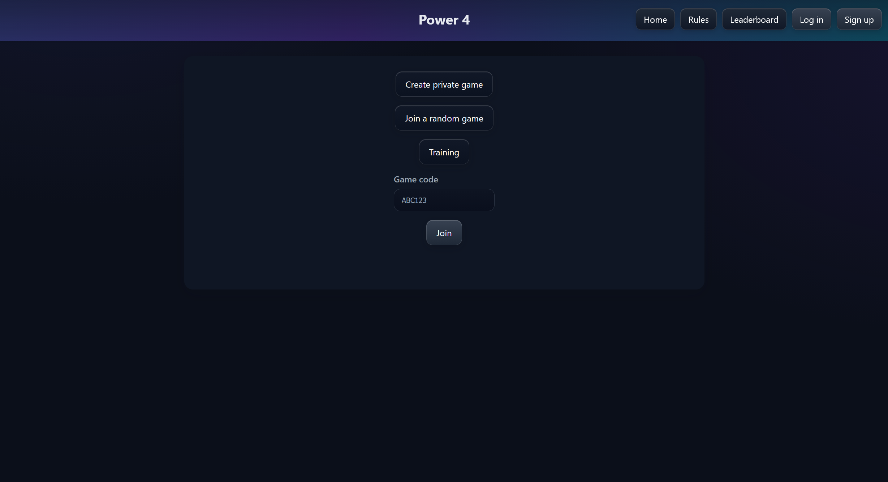
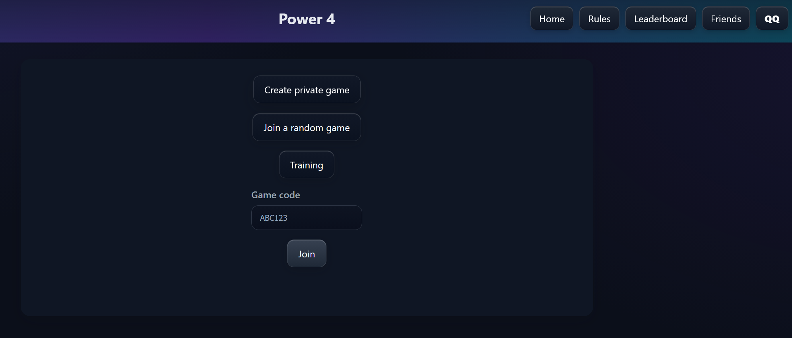
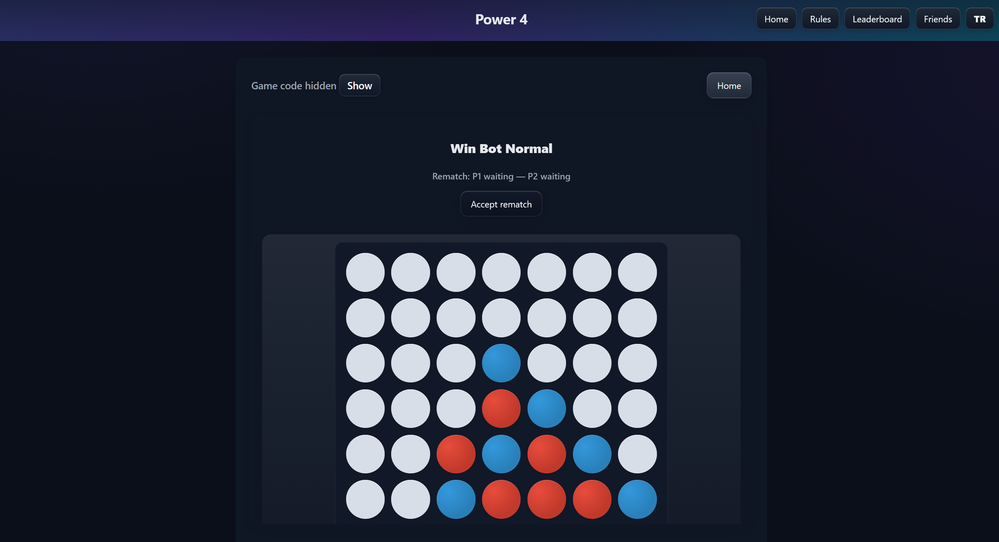
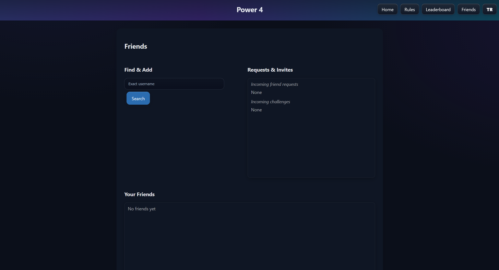
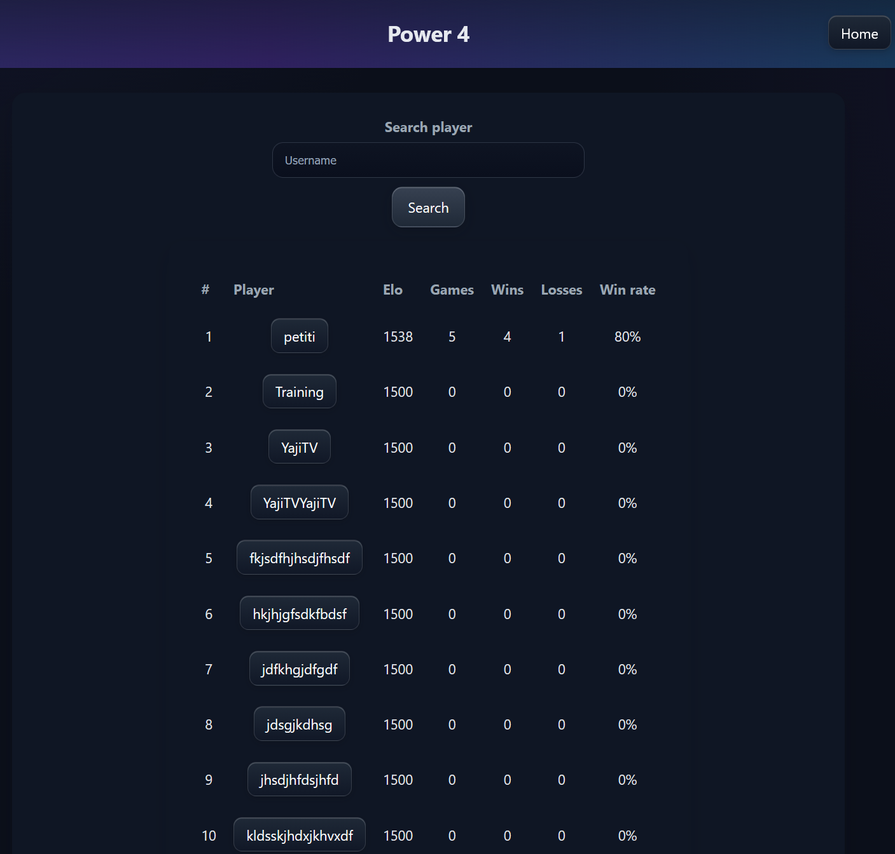

<div align="center">

# 🎮 Power 4

### A modern, real-time Connect Four web game built with Go

[](https://go.dev/)
[](LICENSE.md)
[](http://palawi.fr/power4)

[Features](#-features) • [Quick Start](#-quick-start) • [Gameplay](#-gameplay) • [Tech Stack](#-tech-stack)



</div>

---

## 🎯 Features

<table>
<tr>
<td width="50%">

### 🎲 Game Modes
- **Private Rooms** – Share a code with friends
- **Random Matchmaking** – Find opponents by skill rating
- **Training Mode** – Practice against the AI
- **Friend Challenges** – Direct invites to your friends list

</td>
<td width="50%">

### 👥 Social System
- **Friends List** – Add players and manage requests
- **Real-time Updates** – Auto-refreshing friend status
- **Challenge System** – Send instant game invites
- **User Profiles** – Track stats, Elo, win rate

</td>
</tr>
<tr>
<td>

### ⚡ Real-time Gameplay
- **Live Board Updates** – No JavaScript, pure HTML refresh
- **Turn Timer** – 2-minute deadline per move
- **Rematch System** – Instant rematches with alternating colors
- **Forfeit Option** – Concede gracefully anytime

</td>
<td>

### 📊 Competitive Features
- **Elo Rating System** – Skill-based matchmaking
- **Global Leaderboard** – Top players ranked
- **Match History** – Track your wins/losses
- **Fair Play** – Anti-stalling mechanics

</td>
</tr>
</table>

---

## 🚀 Quick Start

### Prerequisites
- Go 1.21 or higher
- Git

### Installation

Clone the repository

git clone https://github.com/YajiTV/connect4web

cd connect4web

Run the server

go run main.go


Server starts at [**http://localhost:8090**](http://localhost:8090) 🎉

### First Steps
1. Create an account (username + password)
2. Try **Training Mode** to learn the game
3. Join a **Random Game** or create a **Private Room**
4. Add friends and challenge them directly!

---

## 🎮 Gameplay

<div align="center">


### How to Win
Connect **four discs** horizontally, vertically, or diagonally before your opponent!

</div>

### Game Rules
- 7×6 grid, discs drop to the lowest available slot
- Players alternate turns
- First to align 4 discs wins
- Draw if all 42 cells fill with no winner
- Time limit: 2 minutes per turn

---

## 🛠️ Tech Stack

<div align="center">

| Layer | Technology |
|-------|-----------|
| **Backend** | Go (stdlib `net/http`) |
| **Templates** | Go `html/template` |
| **Storage** | JSON files (users, friends, sessions) |
| **Auth** | Session cookies + CSRF tokens |
| **Styling** | Custom CSS (dark theme) |
| **Real-time** | Server-sent meta refresh (no WebSockets) |

</div>

### Why Go?
- ⚡ Lightning-fast response times
- 🔒 Built-in security with standard library
- 📦 Single binary deployment
- 🧵 Concurrent game room management

---

## 📁 Project Structure

```
onnect4/
├── main.go                     # Point d'entrée : démarre le serveur HTTP (port 8090) et appelle app.Boot

├── go.mod                      # Module Go (nom du projet, dépendances)
├── go.sum                      # Verrouillage des versions de dépendances
├── README.md                   # Documentation du projet
├── LICENSE                     # Licence (MIT, auteurs : Baptiste DM & Mathys PK)

├── internal/
│   ├── app/
│   │   └── app.go              # Boot de l'application : charge templates, sessions, stores, routes et retourne le mux
│   │
│   ├── auth/
│   │   ├── store.go            # Gestion des utilisateurs : création, authentification, persistance JSON, stats (Elo, wins, losses)
│   │   ├── session.go          # Gestion des sessions : cookie signé, CSRF, login/logout, CurrentUser
│   │   ├── elo.go              # Algorithme Elo : probabilité de victoire et arrondi des points
│   │   └── util.go             # Fonctions utilitaires éventuelles (hash, validation)
│   │
│   ├── game/
│   │   ├── board.go            # Représentation du plateau 7×6, détection de victoire (lignes, colonnes, diagonales)
│   │   └── moves.go            # AddPeon : pose un pion dans une colonne (gravité), incrémente Moves, gère erreurs
│   │
│   └── http/
│       ├── router.go           # NewRouter : construit le mux, enregistre toutes les routes HTTP, sert les fichiers statiques
│       ├── header.go           # makeHeader : données communes du header (login, initials, badge d’alertes amis, CSRF)
│       ├── homehandler.go      # Page d’accueil, handler 404
│       ├── authhandler.go      # /signup, /login, /logout : formulaires + validation + démarrage de session
│       ├── profilehandler.go   # /u/{username} : profil public, stats et état d’amitié (ami, pending, etc.)
│       ├── ruleshandler.go     # /rules : page des règles du jeu
│       ├── leaderboardhandler.go # /leaderboard : classement global des joueurs par Elo
│       ├── gamehandler.go      # /rooms/create, /rooms/join, /game/{code}, /board/{code}, /play/... : gestion des parties privées
│       ├── matchhandler.go     # /match/... : matchmaking aléatoire basé sur l’Elo, file d’attente, long‑polling
│       ├── friendshandler.go   # /friends/... : système d’amis, demandes, défis, iframes auto‑refresh
│       ├── friends_store.go    # Stockage en mémoire + JSON des amis, demandes, défis (graphes d’amitiés)
│       ├── types.go            # Types Room, file de matchmaking, structures partagées pour les handlers
│       └── errors.go           # Helpers pour NotFound, erreurs génériques (si séparé)

├── templates/
│   ├── base.tmpl               # Template de base (layout, header, container)
│   ├── index.tmpl              # Page d’accueil (Home)
│   ├── login.tmpl              # Formulaire de connexion
│   ├── signup.tmpl             # Formulaire d’inscription
│   ├── profile.tmpl            # Profil utilisateur (stats + boutons amis/défis)
│   ├── rules.tmpl              # Règles du jeu
│   ├── leaderboard.tmpl        # Classement
│   ├── game.tmpl               # Page de partie (plateau + infos joueurs + timer)
│   ├── board.tmpl              # Vue "plateau" seule (utilisée pour le rafraîchissement côté client)
│   ├── clock.tmpl              # Fragment d’horloge / compte à rebours
│   ├── match.tmpl              # Page d’attente matchmaking (Elo range, recherche d’adversaire)
│   ├── friends.tmpl            # Page principale "Friends" (recherche + 2 iframes)
│   ├── friends_requests_iframe.tmpl # Iframe : demandes d’amis + défis reçus, auto‑refresh
│   ├── friends_friends_iframe.tmpl  # Iframe : liste d’amis + boutons Challenge, auto‑refresh
│   ├── challenge_wait.tmpl     # Page "Waiting for your friend..." après envoi d’un défi
│   ├── training.tmpl           # Mode entraînement (si présent)
│   ├── 404.tmpl                # Page d’erreur 404 stylée
│   └── ...                     # Autres templates éventuels

├── static/
│   ├── css/
│   │   ├── base.css            # Styles globaux (layout, typographie, couleurs)
│   │   ├── header.css          # Styles du header (nav, avatar, badge notifications)
│   │   ├── board.css           # Styles du plateau de jeu (grille, pions, animations)
│   │   ├── friends.css         # Styles de la page Friends et des iframes
│   │   ├── error.css           # Styles des pages d’erreur (404, etc.)
│   │   └── util.css            # Classes utilitaires (boutons, flex, helpers)
│   │
│   └── assets/
│       ├── connect4.png        # Icône / favicon du site
│       ├── logo.svg            # Logo éventuel du projet
│       └── ...                 # Autres images (pions, backgrounds, etc.)

├── data/
│   ├── users.json              # Base d’utilisateurs : username, hash de mot de passe, Elo, stats de parties
│   ├── friends.json            # Graphes d’amitiés, demandes en attente, invites de défis persistées
│   ├── session.key             # Clé secrète HMAC (32 octets) pour signer les cookies de session
│   └── sessions/               # Dossier éventuel pour stockage de sessions côté serveur (si utilisé)

└── docs/
    ├── screenshot-home.png     # Capture d’écran page d’accueil
    ├── screenshot-game.png     # Capture d’écran d’une partie
    ├── screenshot-friends.png  # Capture d’écran système d’amis
    ├── screenshot-leaderboard.png # Capture d’écran du classement
    └── gameplay-demo.gif       # GIF animé de démo du gameplay

```

---

## 🎨 Screenshots

<div align="center">

### Home Screen


### Live Game


### Friends System


### Leaderboard


</div>

---

## 🤝 Contributing

Contributions are welcome! Feel free to:

1. Fork the repository
2. Create a feature branch (`git checkout -b feature/amazing`)
3. Commit your changes (`git commit -m 'Add amazing feature'`)
4. Push to the branch (`git push origin feature/amazing`)
5. Open a Pull Request

---

## 📝 License

This project is licensed under the MIT License - see the [LICENSE](LICENSE.md) file for details.

---

## 🎯 Roadmap

- [ ] WebSocket support for instant updates
- [ ] Tournament mode
- [ ] Replay system

---

<div align="center">

### ⭐ Star this repo if you enjoyed playing!

Made with ❤️ and Go / GoHTML / CSS

</div>